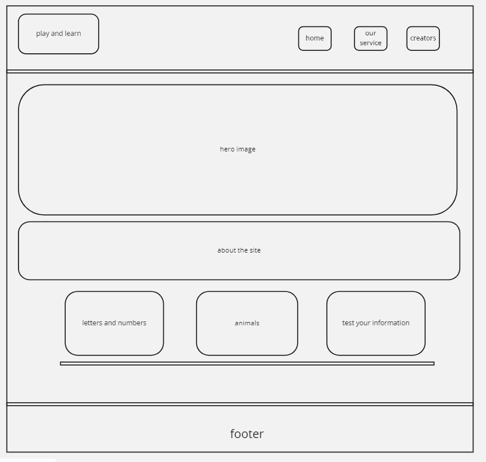
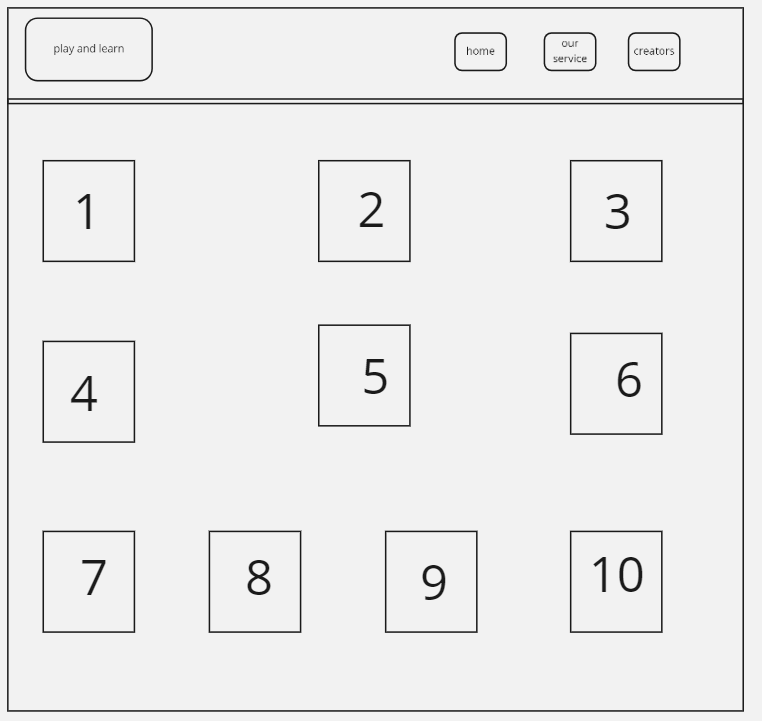
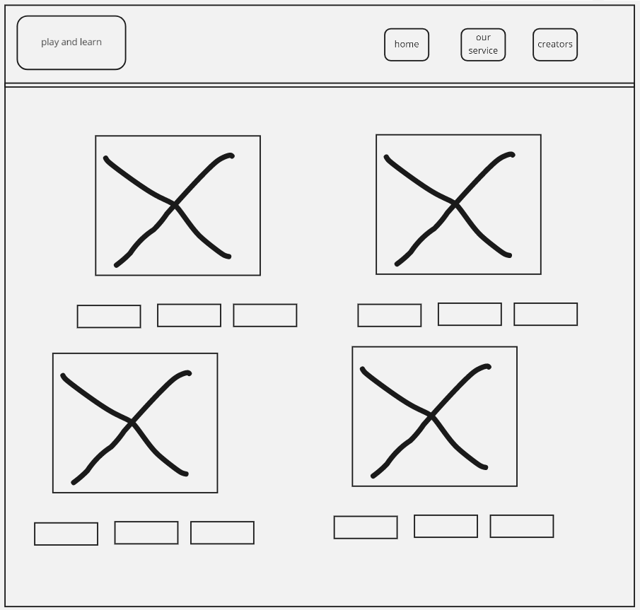
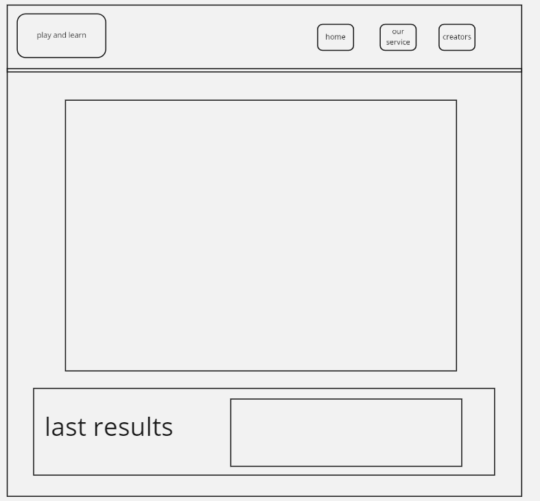

# Game-Learn

Our project is a learning web site that is directed to kids between the age of 4 to 7 for learning english as a second language.Our web site presents kids with three games, each game with a different target that catches a particular aspect of the English language.

 In our project we tried incorporating a lot of catching styles and images, sounds and fun  games that would attract the kid's attention and make them engage in a fun learning experience. The structure of our web page contains four major pages. The first page is the intro page, that will introduce our visitors with a short description of our website and tells a brief paragraph of our vision and of what this website will hopefully achieve.  The second component of the page is three major buttons that will take the kid to each game. 

 * The first game is called  **(letters and numbers)**  it’s aim to teach kids the English letters and numbers. When the kid presses the big button on the home screen it will lead our little friend to a page full of numbers and letters listed randomly and when clicking  on any random number or letter. A sound of pop out introducing the kid of the number or letter he/she clicked on.

* The second game is called **(animales)** when clicked on the button featuring animals on the home screen page, it will lead the kid to a page full of interactive images of different animals with sounds of these animals popping out whenever clicked on one of these images. Under each image there are multiple choices of different animals and the kid is responsible to choose the correct name of the animal image. At the button of the page there is the score that would tell the kid of how many correct answers he/she answered and it will be saved each time the kid plays this game to measure his/her improvement. 

 * The third and final game is a little advanced one. it is a **quiz**. It will be a couple of questions aimed to measure the kid’s information about what he/she learned about from the two previous games. 

The last page will be a creator's page, where there is a previous description and pictures of the creators of this learning and playing game. 

* ** 

# Wirefram
our web page will be consist from 4 seperated pages and we will explain them below :

## 1. Home page 

## 2. Numbers and Letters page

## 3. Animals game page

## 4. quiz game page 

* ** 

# User Stories:

## inroduction page

 * As a user I want the kids using this web site to learn  english in a fun and engaging style. Like a game. 

**Feature Tasks:**
 * Show a brief introduction of the site and a welcoming message
* Show the options for all the games available.
A bitily to select the desired game.

**Acceptance Tests:**
* Ensure the user is moved to the game page when clicking on each option button.  For example: if the the i clicked in the animals game option I will be taken       to the animals game page    

**Estimate your User Stories:**
* Estimated anticipation is “extra small” for this page. It will take less than 2 minutes to scan the components of the page and choose the desired game. 

## Numbers and letters game

* As a kid I want to learn the sounds of English letters and numbers.

**Feature Tasks:**
* Displays a number of images of random letters and numbers.

**Acceptance Tests:**
* Ensure a sound of the letter or number pops up each time the kid clicks on a button

**Estimate your User Stories:**

* Estimated anticipation for this page is “extra large”. The kid can have as time  as he/she wishes clicking on and listening to sounds of numbers and letters. 

 ## Animales’ game

* As a kid I want to learn about different animal sounds  and names in English. 

**Feature Tasks:**

* Display a number of images for animals.

* Show a multiple of choices for animal’s names underneath each image. 

**Acceptance Tests:**

* Ensure a sound the animal pops out for the kid each time he/ehe clicks on the image.

* The ability to select a name from the multiple choices displayed under each image.

* Alert the user of the correct answer if he/she chooses the correct answer.

* Flickering the screen in case the kid chooses the wrong answer.

 

**Estimate your User Stories:**

* Estimated anticipation for this page is “extra large”.  The kid is able to style on this page playing clicking and choosing for as long as he/she desires.

## quiz page

* As a user, i want to tast my information of what I learned in the previous two pages

**Feature Tasks:**

* Display a couple of questions about the numbers, letters, animales.

* Display the score for the user after the quiz game is finished.

**Acceptance Tests:** 

* Calculate the score for the user and display it at the bottom of the page.
* Save every previous score the kid had scored by using Local Storage for the purposes of measuring the kid’s improvement.

**Estimate your User Stories:**

* Estimated anticipation for this page is “extra large”. The kid is able on this page as long as he/she desired to finish the quiz game.  

## Creator’s page 

* As a user I want to know more about the crestores of the educational website. 

**Feature Tasks:**

* Show a brief description of the creators of this website and their pictures.

**Estimate your User Stories:**

* Estimated anticipation for this page is “extra small”. It only takes 5 minute to scan the pictures of the creators and their two lines description of themselves. 

